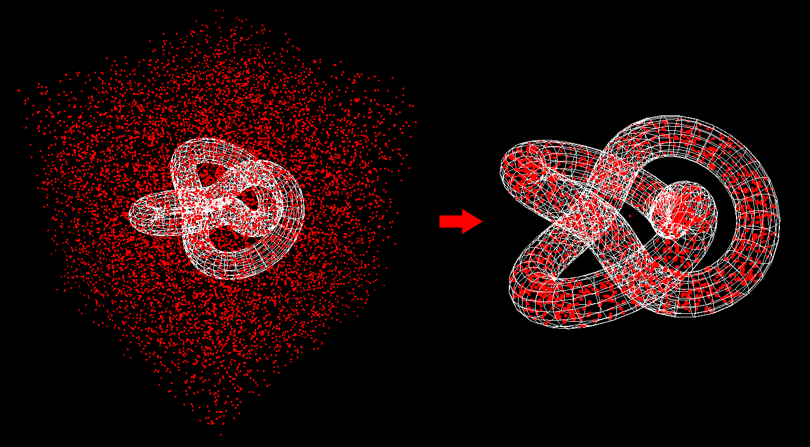

# whether_point_in_3d_model
js check whether point is in 3d model

inspired by <a href="https://blender.stackexchange.com/questions/31693/how-to-find-if-a-point-is-inside-a-mesh" target="_blank">https://blender.stackexchange.com/questions/31693/how-to-find-if-a-point-is-inside-a-mesh</a>
